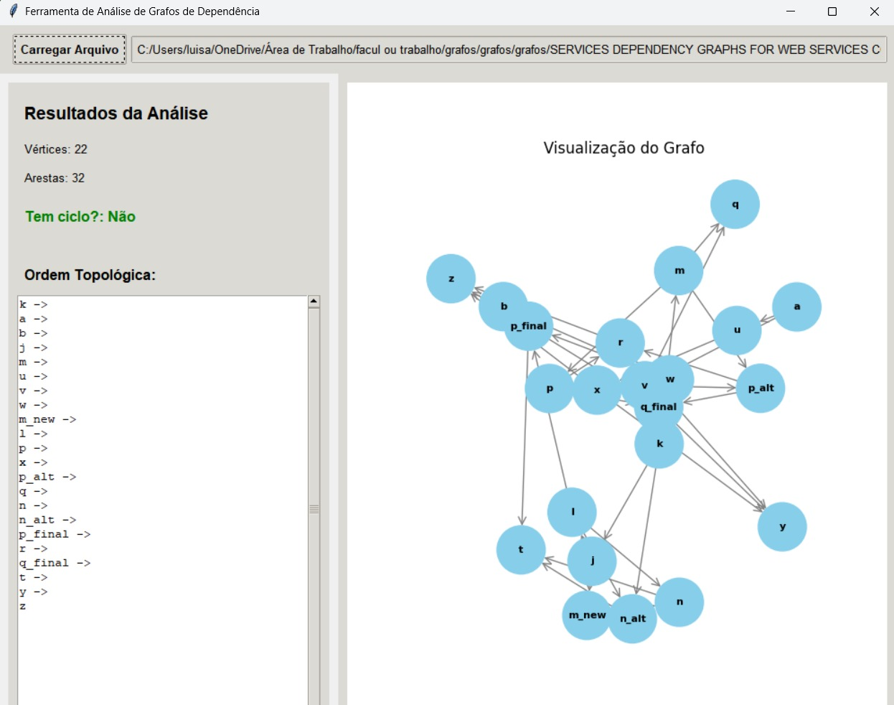
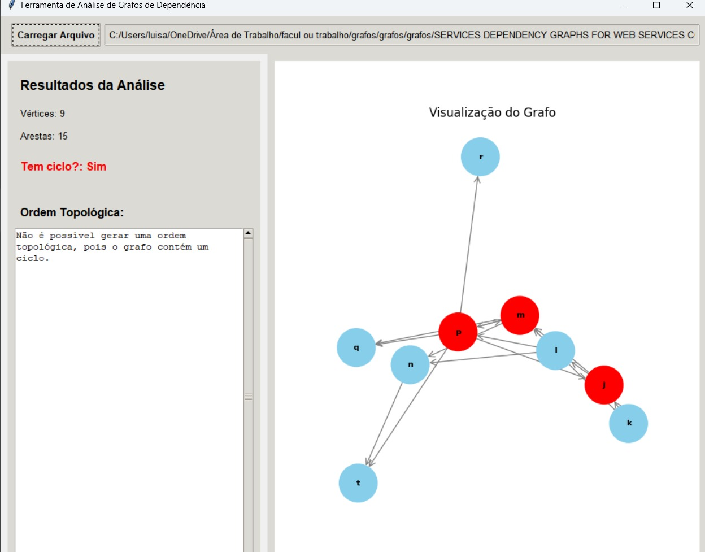

# 📦 Gestão de Conflitos em Sistemas de Dependência
> Trabalho Prático — Grafos (2025)

Projeto acadêmico desenvolvido em **Python** para simular sistemas de tarefas interdependentes utilizando grafos dirigidos. O objetivo é detectar **ciclos de dependência**, executar uma **ordenação topológica segura** e fornecer **visualização interativa** do grafo.

---

## 🎯 Objetivo

- Representar tarefas e dependências como um **grafo dirigido**
- Detectar **ciclos** que inviabilizam a execução
- Realizar **ordenação topológica** para definir a execução segura
- Visualizar o grafo e permitir interação com o usuário

---

## 🛠️ Tecnologias Utilizadas

| Tecnologia  | Uso                                   |
|-------------|----------------------------------------|
| Python    | Linguagem de programação principal     |
| Python,networkx,matplotlib,scipy      | Interface gráfica |
| matplotlib networkx pandas | Visualização gráfica de grafos (extra) |
| Git         | Controle de versão                     |

---

## 📁 Estrutura do Projeto

```

├── 📁 src/
|
├── 📁 relatorio/
|
├── 📁 dados/
|
└── README.md
```
---

## ▶️ Como Executar o Projeto

## 📥 Formato Esperado dos Dados (Xml)

```Xml
{
  "tarefas": [
    { "id": "A", "dependencias": [] },
    { "id": "B", "dependencias": ["A"] },
    { "id": "C", "dependencias": ["A", "B"] },
    { "id": "D", "dependencias": ["C"] }
  ]
}
```

---

## 📋 Funcionalidades

- ✅ Leitura de dados a partir de `.xml` ou `.csv`
- ✅ Construção de grafo dirigido com tarefas
- ✅ Detecção de ciclos (DFS)
- ✅ Ordenação topológica segura (Kahn)
- ✅ Interface gráfica com interação de escolha de arquivo e visualização

---

## 📈 Visualização (Em Planejamento)

> Em python:
- Cores diferentes para ciclos detectados
- Ordem de execução numerada
- Feedback ao usuário com logs

---

## ✅ Testes

```bash
mvn test
```

> Testes em JUnit para:
- Casos com e sem ciclos
- Ordenação topológica correta
- Leitura de arquivos de dados

---

## ▶ Como Executar a Aplicação em Python

> ⚠ Esta seção refere-se à versão Python do projeto, localizada em src/Codigo.py.

### Requisitos

- *Python 3.8 ou superior*
- *Bibliotecas Python:*
  - tkinter (normalmente já incluso no Python)
  - pandas
  - networkx
  - matplotlib

### Instalação das Dependências

Abra o terminal na pasta raiz do projeto e execute:

bash
pip install pandas networkx matplotlib


> Obs.: O tkinter geralmente já vem instalado com o Python. Caso não esteja, instale conforme o seu sistema operacional:
> - *Windows:* normalmente já está incluso.
> - *Linux (Debian/Ubuntu):*  
>   sudo apt-get install python3-tk
> - *MacOS:* já incluso no Python oficial.

### Como Executar

1. Navegue até a pasta src do projeto:
    bash
    cd src
2. Execute o arquivo principal:
    bash
    python Codigo.py
    
3. A interface gráfica será aberta.  
   Use o botão "Carregar Arquivo" para selecionar um arquivo .xml ou .txt de dependências de grafo.

## Videos e prints de execução

Prints de exemplos de execução e video de execução





[Ver vídeo](relatorio/video_python.mp4)

## 👥 Equipe

| Nome                | Função no Projeto                         |
|Victor L. Tornelli   | Modelagem de grafos e documentação inicial|
| ------------------  | -----------------------------------       |
| Luisa,Luiz  | Interface gráfica                         |
| Davi, Pedro | Leitura de arquivos e testes              |
| Pedro, Davi | Integração                                |

---

## 📜 Licença

Uso acadêmico sob responsabilidade da equipe.  
Desenvolvido para fins educacionais na disciplina de Grafos – 2025.

---
